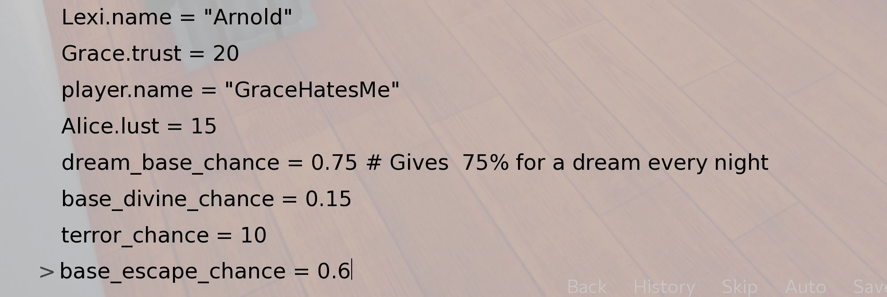
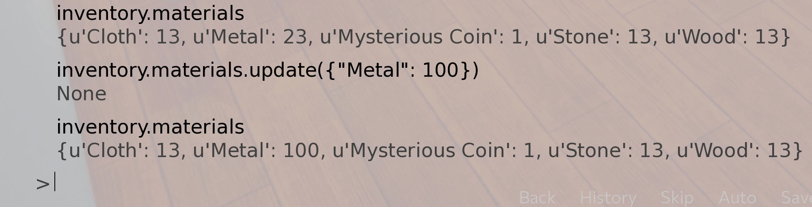

In-game Console
===============

When you do a mod, or simply want to cheat, you need to use in-game console,
you can do almost everything with it, as it's in fact a python console.

What you want to do the most is to change variables or jump to labels, here's how to do that.

Console can be opened with ``SHIFT + O``.
To open the console you need `AL Mod Toolkit <https://mega.nz/file/9IdixbpQ#8-UTQxscq22lC27GqayTaQMYIqYL2EKDSy4czEYvvPo>`_.
You don't know how to install it? Check :ref:`Get Started <tab_tutorial>`.

* `Developer Tools <https://www.renpy.org/doc/html/developer_tools.html#developer-tools>`_
* `Python <https://www.w3schools.com/python/python_variables.asp>`_

|
|

Help! I've fucked up my game!
-----------------------------

Sometimes you can do something that throws an error.
I don't mean error in the console after writing a wrong code, error you get outside of a console as a result of your code.

Don't save the game!
You should immediately load save file before this error, if in this save your changes are also present, then you need to undo them.
If you don't know how, then use older save. None of them is clean? Well, you'll need to start from the beginning.

You can always ignore the problem, but it'll probably lead to corruption of save, or persistent data.
If persistent data gets corrupted you won't be able to launch your game.

Sometimes the error might straight throw you to the desktop, and launching game again don't work.
Don't panic, it happens probably because of developer mode turned on, it tries to immediately start where it crashed, making it crash again.

Simply move ``zzz_mod_toolkit.rpyc`` and ``zzz_mod_toolkit.rpy`` outside of Astral Lust folder and launch the game.
After it launches properly, exit the game normally. You should be able to enter the game again.

If that didn't help, that means your persistent was corrupted. The only thing to do now is to delete ```persistent`` in:

* Windows - ``C:\Users\UserName\AppData\Roaming\RenPy\AstralLust``
* Macintosh - ``$HOME/Library/RenPy/AstralLust``
* Linux - ``$HOME/.renpy/AstralLust``

Save the game before playing with console!

|
|

Jump to a label
---------------

To jump to a label we simply need to use ``jump label_name``.


We can alternatively use call, jump might sometimes lead to weird outcome if label you jumped to ends with return.
Call ensures that's not the case.

.. image:: console_2.webp

|
|

Change a variable
-----------------

That's simple -> ``variable = new_value``


Why I changed Lexi's name to Arnold? I don't know either. Some more examples:



Some variables changed this way might reset after exiting the game (like chances), do a mod for the changes to be permanent.

|
|

Add items to the inventory
--------------------------

``inventory.materials`` will show you all items you have, with their amount
``inventory.materials.update({"item": amount})`` will make us posses ``amount`` of said ``item``.


