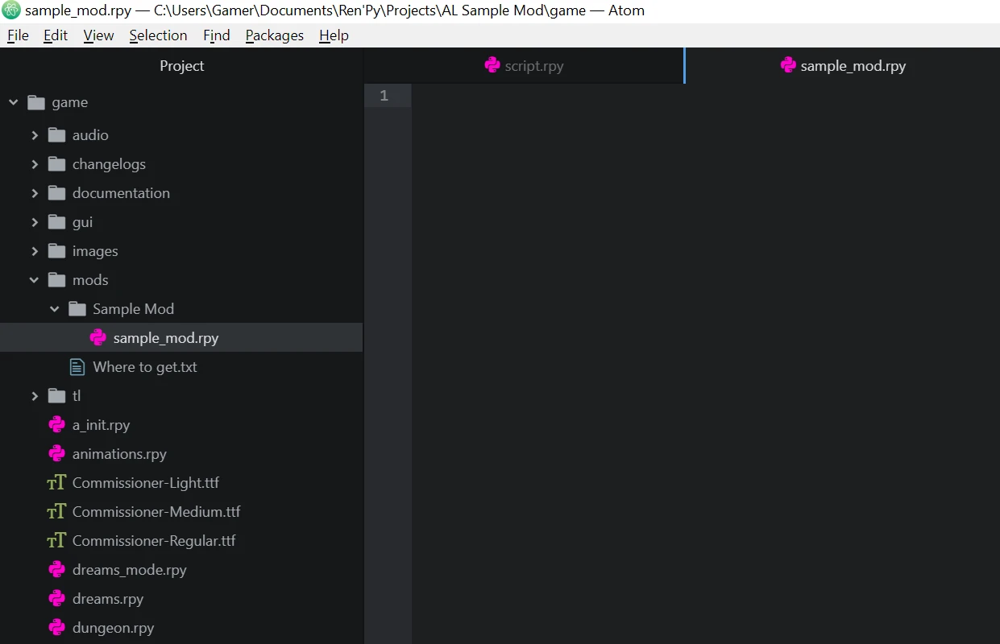

Get Started - Astral Lust Modding
=================================

Welcome to Astral Lust modding tutorial! In here I'll explain how to create your own mod. I'll show how to start, make your own card, character, and a simple animated dream.

Step 1. Preparation for modding
-------------------------------

To get started with modding AL (Astral Lust) you don't need programming knowledge, you don't even need to know basics about ``Ren'Py``.

Of course to do more advanced stuff, you'll need to know them, but there are many things you can do by following this documentation, without any other requirements.

You should start by downloading `RenPy`_. It's needed to compile your mod, in other words - make it work. Once you launch RenPy it'll ask you for text editor, I personally use Atom, you can check in google what they look like, and choose the one that you like the most.

.. _RenPy: https://www.renpy.org/latest.html

You'll need to select RenPy's projects folder, and you need to put Astral Lust to the folder you've chosen. Before launching the project you need to decompile vanilla script with `Un.rpyc`_, otherwise game won't start.

.. _Un.rpyc: https://github.com/CensoredUsername/unrpyc/releases/tag/v1.1.5

Next thing to download is `AL Mod Toolkit`_, it enables console and developer tools in-game, you need to put it into:

.. _AL Mod Toolkit: https://mega.nz/file/9IdixbpQ#8-UTQxscq22lC27GqayTaQMYIqYL2EKDSy4czEYvvPo

* Windows/Linux: ``AstralLust\``
* Mac: ``AstralLust\Contents\Resources\autorun\``

Great, now that you have everything ready you can start to make your own mod! (You can rename AstralLust folder to whatever name you want, this name will be shown in projects)

Step 2. Creating new mod
------------------------

After you done all preparations, run RenPy. You'll see something like this:

.. image:: tutorial_1.webp

Under ``Edit File`` tab chose ``script.rpy``, now you need to create your mod's folder in ``game/mods`` folder, as shown below:

.. image:: tutorial_2.webp

Now using the same way we create a new file inside our folder, you can name it whatever you want, the important thing is to include ``.rpy`` extension at the end. I'll name my file ``sample_mod.rpy``. Now that you've your first file, open it by selecting it from file tree.

Step 3. Adding animated dream
-----------------------------

What (arguably) is the most important thing in RenPy games? Events. So let's make our own event, a dream to be exact.

First we need to create a label, label is a point in a story to which you can jump later on. ``label mylabelname:``

For compatibility purpose you should add your unique prefix to label names so that there are never two label with the same name (it'll throw an error).

Important thing to note is that dreams need special label name to autodetect (``d_mydream_0``, start with ``d_``, then your own dream (with prefix) name, and at the end :ref:`dream type<tab_dreams>`. ``_0``, 0 stands for normal/positive dream).
I'll name my dream as ``d_Sample_Dream_0``, when dream name is converted to text ``_`` is changed to empty space `` ``.

.. code-block::

  label d_Sample_Dream__0:

Now we want to add this animated background, so what we need is, well, a video. It can be .mp4 or .webm (`read more`_). It needs to be put somewhere in ``game\images\`` folder. I would say, the best would be to create our own folder ``images\Mods\Sample Mod``

.. _read more: https://www.renpy.org/doc/html/movie.html#movie

So we have our movie, let's define it in the script, it needs to be defined outside of label:

.. code-block::

  image sample movie = Movie(play="Mods/Sample Mod/sample_movie.webm", loop = True, size = {gui.game_width, gui.game_height})
