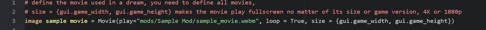
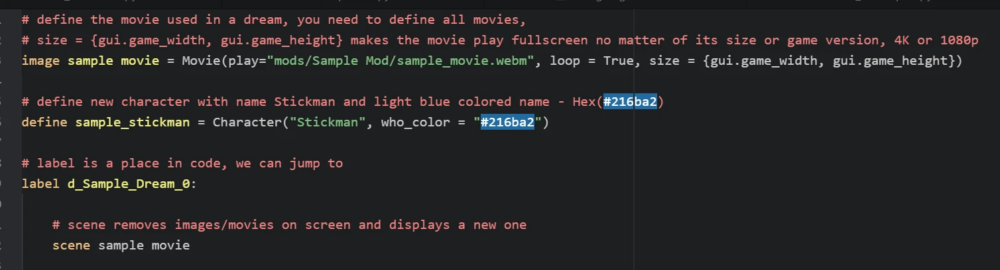
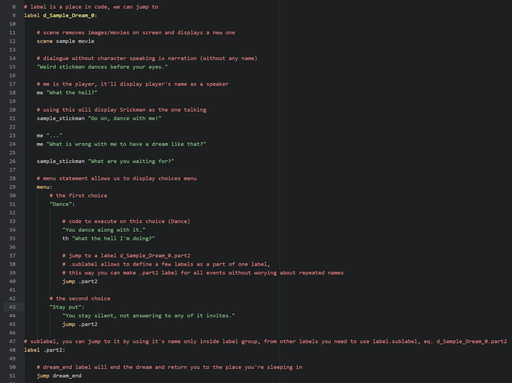
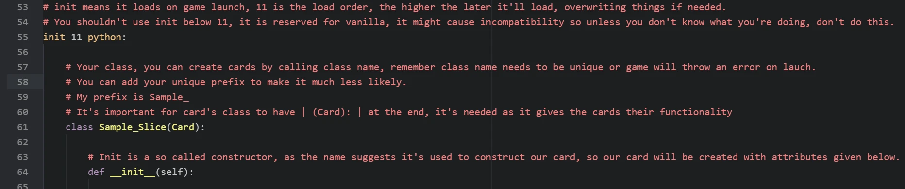
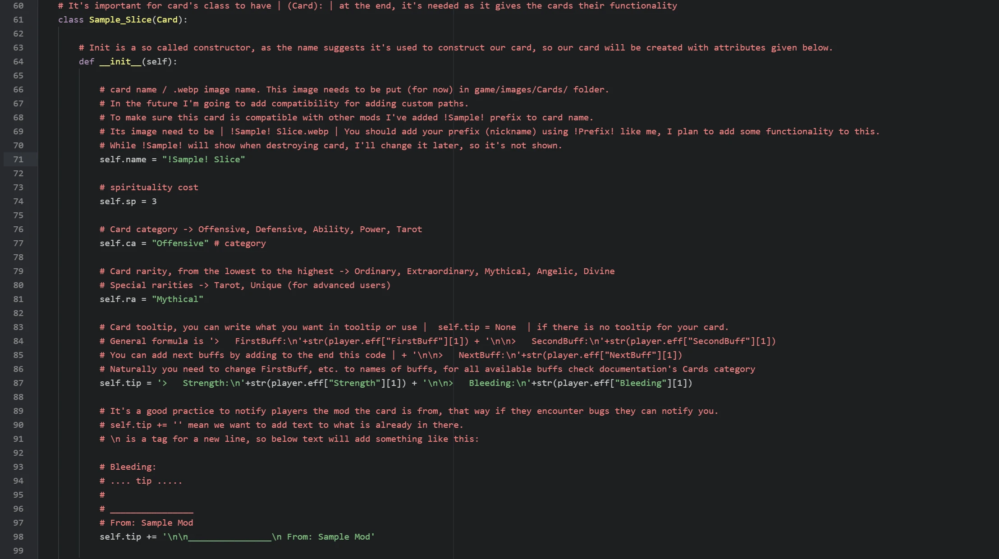
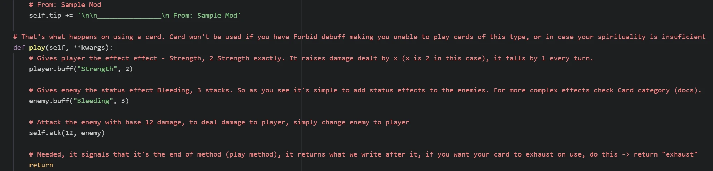
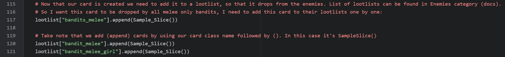

Get Started - Astral Lust Modding
=================================

Welcome to Astral Lust modding tutorial! In here I'll explain how to create your own mod. I'll show how to start, make your own card, character, and a simple animated dream.

|
|

.. _tab_tutorial:

Step 1. Preparation for modding
-------------------------------

To get started with modding AL (Astral Lust) you don't need programming knowledge, you don't even need to know basics about ``Ren'Py``.

Of course to do more advanced stuff, you'll need to know them, but there are many things you can do by following this documentation, without any other requirements.

You should start by downloading `RenPy`_. It's needed to compile your mod, in other words - make it work. Once you launch RenPy it'll ask you for text editor, I personally use Atom, you can check in google what they look like, and choose the one that you like the most.

.. _RenPy: https://www.renpy.org/latest.html

You'll need to select RenPy's projects folder, and you need to put Astral Lust to the folder you've chosen. Before launching the project you need to decompile vanilla script with `Un.rpyc`_, otherwise game won't start.

.. _Un.rpyc: https://github.com/CensoredUsername/unrpyc/releases/tag/v1.1.5

Next thing to download is `AL Mod Toolkit`_, it enables console and developer tools in-game, you need to put it into:

.. _AL Mod Toolkit: https://mega.nz/file/9IdixbpQ#8-UTQxscq22lC27GqayTaQMYIqYL2EKDSy4czEYvvPo

* Windows/Linux: ``AstralLust\``
* Mac: ``AstralLust\Contents\Resources\autorun\``

Great, now that you have everything ready you can start to make your own mod! (You can rename AstralLust folder to whatever name you want, this name will be shown in projects)

|
|

Step 2. Creating new mod
------------------------

After you done all preparations, run RenPy. You'll see something like this:

.. image:: tutorial_1.webp

|

Under ``Edit File`` tab chose ``script.rpy``, now you need to create your mod's folder in ``game/mods`` folder, as shown below:

|

Now using the same way we create a new file inside our folder, you can name it whatever you want, the important thing is to include ``.rpy`` extension at the end. I'll name my file ``sample_mod.rpy``. Now that you've your first file, open it by selecting it from file tree.

.. image:: tutorial_3.webp

|
|

Step 3. Adding animated dream
-----------------------------

What (arguably) is the most important thing in RenPy games? Events. So let's make our own event, a dream to be exact.

We want to add animated background, so what we need is, well, a video. It can be .mp4 or .webm. We can put it into our mod folder.

`Movies <https://www.renpy.org/doc/html/movie.html#movie>`_

|

So we have our movie, let's define it in the script, it needs to be defined outside of a label (you'll understand later).

It goes like this: ``image my_movie_name = Movie(play="mods/My Mod Name/my_movie.webm", loop = True, size = {gui.game_width, gui.game_height})``

`Defining Images <https://www.renpy.org/doc/html/displaying_images.html?highlight=image#defining-images>`_

Now that we have our animation, let's define a character that'll speak in our label (also outside of a label). We can do this with
``define our_character = Character("char_name")``. So I want my character to be a stickman. Don't ask why, I just want.

After we define our character, it's time to finally create a label. What is it? Label is a point in a story to which you can jump later on. ``label mylabelname:``

For compatibility purpose you should add your unique prefix to label names so that there are never two label with the same name (it'll throw an error).

Important thing to note is that dreams need special label name to autodetect (``d_mydream_0``, starts with ``d_``, then your own dream (with prefix) name, and at the end :ref:`dream type<tab_dreams>`. ``_0``, 0 stands for normal or positive dream).
I'll name my dream as ``d_Sample_Dream_0``, when dream name is converted to text ``_`` is changed to empty space.

`Labels & Control Flow <https://www.renpy.org/doc/html/label.html?highlight=labels>`_

`Defining Characters <https://www.renpy.org/doc/html/dialogue.html?highlight=character#defining-character-objects>`_

After all we are all set up.
Let's finally use this movie, we can display it with ``show`` or ``scene`` statement.
What's the difference? Scene removes previous images, it's good to use it if we have image covering whole screen and we don't want anything else to display.
Our movie covers the whole screen and we don't want other images or movies on screen so let's use ``scene my_movie_name``. You can add transiton ``with fade`` or ``with dissolve``.

`Show & Scene statements <https://www.renpy.org/doc/html/displaying_images.html?highlight=image#show-statement>`_

`Transitions <https://www.renpy.org/doc/html/transitions.html>`_

|

Alright, Now we need to write the scene, dialogue, choices, etc. This all is covered below.

`Dialogue and Narration <https://www.renpy.org/doc/html/dialogue.html?highlight=dialogues>`_

|

Dream is ready!

:ref:`Dreams<tab_dreams>`

|
|

Step 4. Adding a card
---------------------

Now that we have a dream, it's time to do something a little more complex. Let's make a card.

We need to initialize a card at init time so we start by adding (outside of label) ``init 11 python:``.
As you might have noticed, when we use ``:`` the lines below are indented.
Basically speaking it means that below code belongs to the thing with ``:``.
Indentation shows the code this belonging.
In python indentations are the key unlike in most other languages where they are just cosmetic.

Alright, enough about other things, other thing you should remember is that AL reserves init -999 to 10 & 995-999, so you should use init 11 to init 994.
The higher the init the later it loads (and overwrites previous changes if needed). Unless you know what you're doing, don't use reserved init numbers.

Finally, after this sermon comes a time to create our card!
We need to start by defining class like this ``class OurClassName(Card):`` of course change OurClassName to your name.
You can name it as ``class prefix_cardname(Card):``. More info on this in comments in example script down below.

As you probably noticed (or not) class definition ends with ``:``, so does it mean next line will be indented?
Of course it'll be indented, didn't you read my sermon? If it's not we will see an error when we try to launch our game.

Now the indented code -> ``def __init__(self):``. ``def methodName():`` is defining a method or function.
This is method commonly used in python as a constructor, it'll assign attributes to our card.
You probably took note of ``:`` at the end.
Does it mean there will be second indentation? Yes! Great, right? Indentations look neat.

|

So in ``def __init__(self):`` we need to assign attributes to our class, or as you prefer variables.
When assigning and using these attributes within our class we need to type ``self.`` before them.
Like this ``self.name = "MyCard"``.

Cards have those attributes:

* ``name`` - self explaining
* ``sp`` - spirituality cost
* ``ca`` - category:

  * Offensive
  * Defensive
  * Ability
  * Power
  * Tarot

* ``ra`` - rarity:

  * Ordinary
  * Extraordinary
  * Mythical
  * Angelic
  * Divine

* ``tip`` - card's tooltip to display on hover (explained in example script)

|

So our card now can be created, but it still does nothing.
Let's change that.
We need to create ``play()`` method.
Like this ``def play(self, **kwargs):``.

Remember to return to indentation depth of class! In other words ``def play`` needs to be at the same indentation as ``def __init__``.

Now you need to let your creativity take over. To attack use ``self.atk(dmg, enemy)`` change damage to number you want, like this ``self.atk(5, enemy)``.

To change status effects use ``buff()`` method. It works like this ``player.buff(buff, amt, minus = True)``.
By default status effect can be lowered below 0, to make it stop at 0 descrease effects with minus = False.
Let's say you want to decrease enemy's Vulnerable effect by 5, but you don't want it to be below 0.
It works like that ``enemy.buff("Vulnerable", -5, False)``.

Important thing is you need to add ``return`` at the end of method.
It signals the program that it's the end of method.
You can use it like this ``return "exhaust"`` if you want to exhaust a card, otherwise use just ``return``.

Example below.

:ref:`Cards<tab_cards>`

:ref:`List of status effects<tab_cards_effects>`

|

We have a working card. Nice! One thing.. how do you get it?? It's not like a dream, which happens randomly.

This is actually the easiest part of this tutorial. Just read the comments in the example below, nothing more is needed to be said.

:ref:`Lootlists<tab_lootlists>`

|

Remember to create your card image!
Check documentation's Cards to get card templates and how to use them.
Paint is enough to make a card, better programs (like free paint.net I'm using) are welcome, though.
The best for a job like this would probably be Corel or PhotoShop.

|
|

Step 5. Test with console
-------------------------

Done!

Our card and dream were successfully created!
Now what remains is to check them in-game.

Load your save and open the console by pressing SHIFT + O

To try our dream -> jump d_Sample_Dream_0
Change dream label to your label

To add our card to hand -> inventory.cards.append(Sample_Slice())
Again, change Sample_Slice to your card's class name

`Developer Tools <https://www.renpy.org/doc/html/developer_tools.html?highlight=console#developer-tools>`_

|
|

Congratulations!
You've officially made your first mod for the Astral Lust!
Even Grace is proud of you!

Now that you know how, you can add more, check the documentation for info how to do that.
Remember - have fun! Will you be the first to change the Dragon images to Thomas the Tank Engine? ;)

Don't hesitate to ask me questions on official Astral Lust Discord server. You can also post your mods there, in #mods-releases channel.

:ref:`Easy to tweak variables<tab_customize>`

|
|

Next Step
---------

While where you should go from now on depends on what you want to make, I would recommend :ref:`Creation Guide<create_guide>` to learn many basic things about Renpy's working.

|
|

Final Script - Comments
-----------------------

The same code can be found in ``game/mods/Sample Mod/sample_mod.rpy``.

.. code-block:: python
  :linenos:

  # define the movie used in a dream, you need to define all movies, size = {gui.game_width, gui.game_height} makes the movie play fullscreen no matter of its size or game version, 4K or 1080p
  image sample movie = Movie(play="mods/Sample Mod/sample_movie.webm", loop = True, size = {gui.game_width, gui.game_height})

  # define new character with name Stickman and light blue colored name - Hex(#216ba2)
  define sample_stickman = Character("Stickman", who_color = "#216ba2")

  # label is a place in code, we can jump to
  label d_Sample_Dream_0:

      # scene removes images/movies on screen and displays a new one
      scene sample movie

      # dialogue without character speaking is narration (without any name)
      "Weird stickman dances before your eyes."

      # me is the player, it'll display player's name as a speaker
      me "What the hell?"

      # using this will display Srickman as the one talking
      sample_stickman "Go on, dance with me!"

      me "..."
      me "What is wrong with me to have a dream like that?"

      sample_stickman "What are you waiting for?"

      # menu statement allows us to display choices menu
      menu:
          # the first choice
          "Dance":

              # code to execute on this choice (Dance)
              "You dance along with it."
              th "What the hell I'm doing?"

              # jump to a label d_Sample_Dream_0.part2
              # .sublabel allows to define a few labels as a part of one label,
              # this way you can make .part2 label for all events without worying about repeated names
              jump .part2

          # the second choice
          "Stay put":
              "You stay silent, not answering to any of it invites."
              jump .part2

  # sublabel, you can jump to it by using it's name only inside label group, from other labels you need to use label.sublabel, eq. d_Sample_Dream_0.part2
  label .part2:

      # dream_end label will end the dream and return you to the place you're sleeping in
      jump dream_end

  # init means it loads on game launch, 11 is the load order, the higher the later it'll load, overwriting things if needed.
  # You shouldn't use init below 11, it is reserved for vanilla, it might cause incompatibility so unless you don't know what you're doing, don't do this.
  init 11 python:

      # Your class, you can create cards by calling class name, remember class name needs to be unique or game will throw an error on lauch. You can add your unique prefix to make it much less likely.
      # My prefix is Sample_
      # It's important for card's class to have | (Card): | at the end, it's needed as it gives the cards their functionality
      class Sample_Slice(Card):

          # Init is a so called constructor, as the name suggests it's used to construct our card, so our card will be created with attributes given below.
          def __init__(self):

            # card name / .webp image name. This image needs to be put (for now) in game/images/Cards/ folder.
            # In the future I'm going to add compatibility for adding custom paths.
            # To make sure this card is compatible with other mods I've added !Sample! prefix to card name.
            # Its image need to be | !Sample! Slice.webp | You should add your prefix (nickname) using !Prefix! like me, I plan to add some functionality to this.
            # While !Sample! will show when destroying card, I'll change it later, so it's not shown.
            self.name = "!Sample! Slice"

            # spirituality cost
            self.sp = 3

            # Card category -> Offensive, Defensive, Ability, Power, Tarot
            self.ca = "Offensive" # category

            # Card rarity, from the lowest to the highest -> Ordinary, Extraordinary, Mythical, Angelic, Divine
            # Special rarities -> Tarot, Unique (for advanced users)
            self.ra = "Mythical"

            # Card tooltip, you can write what you want in tooltip or use |  self.tip = None  | if there is no tooltip for your card.
            # General formula is '>   FirstBuff:\n'+str(player.eff["FirstBuff"][1]) + '\n\n>   SecondBuff:\n'+str(player.eff["SecondBuff"][1])
            # You can add next buffs by adding to the end this code | + '\n\n>   NextBuff:\n'+str(player.eff["NextBuff"][1])
            # Naturally you need to change FirstBuff, etc. to names of buffs, for all available buffs check documentation's Cards category
            self.tip = '>   Strength:\n'+str(player.eff["Strength"][1]) + '\n\n>   Bleeding:\n'+str(player.eff["Bleeding"][1])

            # It's a good practice to notify players the mod the card is from, that way if they encounter bugs they can notify you.
            # self.tip += '' mean we want to add text to what is already in there.
            # \n is a tag for a new line, so below text will add something like this:

            # Bleeding:
            # .... tip .....
            #
            # ________________
            # From: Sample Mod
            self.tip += '\n\n________________\n From: Sample Mod'

          # That's what happens on using a card. Card won't be used if you have Forbid debuff making you unable to play cards of this type, or in case your spirituality is insuficient
          def play(self, **kwargs):

            # Gives player the effect effect - Strength, 2 Strength exactly. It raises damage dealt by x (x is 2 in this case), it falls by 1 every turn.
            player.buff("Strength", 2)

            # Gives enemy the status effect Bleeding, 3 stacks. So as you see it's simple to add status effects to the enemies. For more complex effects check Card category (docs).
            enemy.buff("Bleeding", 3)

            # Attack the enemy with base 12 damage, to deal damage to player, simply change enemy to player
            self.atk(12, enemy)

            # Needed, it signals that it's the end of method (play method), it returns what we write after it, if you want your card to exhaust on use, do this -> return "exhaust"
            return

      # Now that our card is created we need to add it to a lootlist, so that it drops from the enemies. List of lootlists can be found in Enemies category (docs).
      # So I want this card to be dropped by all melee only bandits, I need to add this card to their lootlists one by one:
      lootlist["bandits_melee"].append(Sample_Slice())

      # Take note that we add (append) cards by using our card class name followed by (). In this case it's SampleSlice()
      lootlist["bandit_melee"].append(Sample_Slice())
      lootlist["bandit_melee_girl"].append(Sample_Slice())

      # Remember to create your card image!
      # Check documentation's Cards to get card templates and how to use them
      # Paint is enough to make a card, better programs (like free paint.net I'm using) are welcome, though.
      # The best for a job like this would probably be Corel or PhotoShop.

      # Done!
      # -----
      # Our card and dream were succesfully created!
      # Now what remains is to check them in-game.
      #
      # Load your save and open the console by pressing SHIFT + O
      #
      # To try our dream -> jump d_Sample_Dream_0
      # Change dream label to your label
      #
      # To add our card to hand -> inventory.cards.append(Sample_Slice())
      # Again, change Sample_Slice to your card's class name
      #
      # Congratulations!
      # You've officialy made your first mod for the Astral Lust!
      # Even Grace is proud of you!
      #
      # Now that you know how, you can add more, check the documentation for info how to do that.
      # Remember - have fun! Will you be the first to change the Dragon images to Thomas the Tank Engine? ;)
      #
      # Don't hesitate to ask me questions on official Astral Lust Discord server. You can also post your mods there, in #mods-releases channel.

|
|

Final Script - Clean
--------------------

.. code-block:: python
  :linenos:

  image sample movie = Movie(play="mods/Sample Mod/sample_movie.webm", loop = True, size = {gui.game_width, gui.game_height})

  define sample_stickman = Character("Stickman", who_color = "#216ba2")

  label d_Sample_Dream_0:
      scene sample movie

      "Weird stickman dances before your eyes."
      me "What the hell?"
      sample_stickman "Go on, dance with me!"
      me "..."
      me "What is wrong with me to have a dream like that?"
      sample_stickman "What are you waiting for?"

      menu:
          "Dance":
              "You dance along with it."
              th "What the hell I'm doing?"

              jump .part2

          "Stay put":
              "You stay silent, not answering to any of it invites."
              jump .part2

  label .part2:

      jump dream_end

  init 11 python:
    class Sample_Slice(Card):
          def __init__(self):
              self.name = "!Sample! Slice"
              self.sp = 3
              self.ca = "Offensive"
              self.ra = "Mythical"
              self.tip = '>   Strength:\n'+str(player.eff["Strength"][1]) + '\n\n>   Bleeding:\n'+str(player.eff["Bleeding"][1])
              self.tip += '\n\n________________\n From: Sample Mod'

          def play(self, **kwargs):
              player.buff("Strength", 2)
              enemy.buff("Bleeding", 3)
              self.atk(12, enemy)

              return

  lootlist["bandits_melee"].append(Sample_Slice())
  lootlist["bandit_melee"].append(Sample_Slice())
  lootlist["bandit_melee_girl"].append(Sample_Slice())
